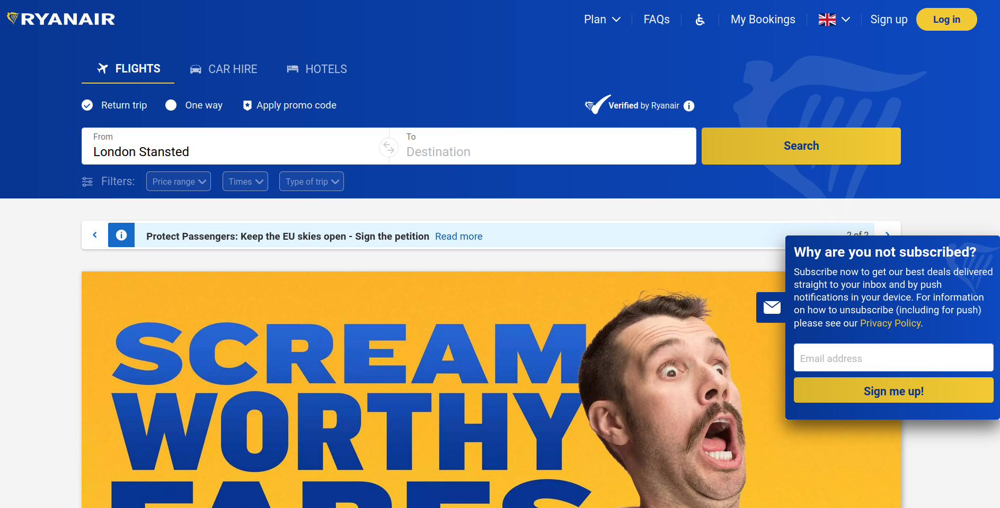
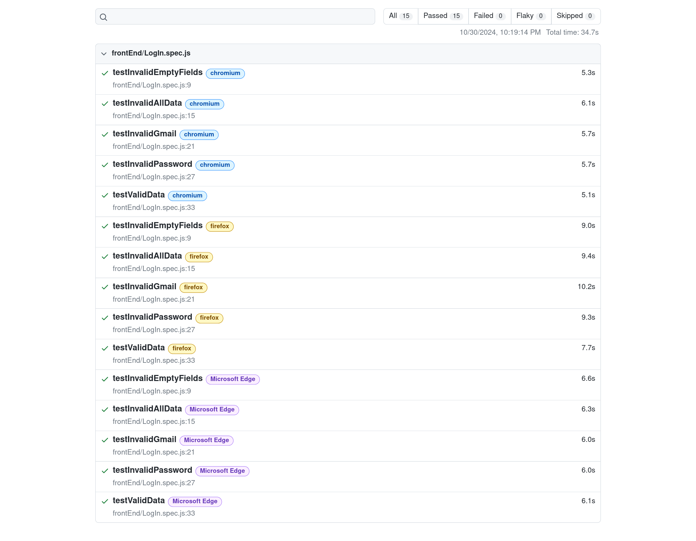

#### Ryanair Holdings plc is Europe’s largest airline group and parent company of Ryanair, Ryanair UK, Buzz, Lauda and Malta Air. Carrying c.200m guests p.a. on over 3,600 daily flights from 95 bases, the Group connects 235 airports in 37 countries on a fleet of 584 aircraft, with a further 364 Boeing 737 on order, which will enable the Ryanair Group to grow traffic to 300m p.a. by FY34

______________

